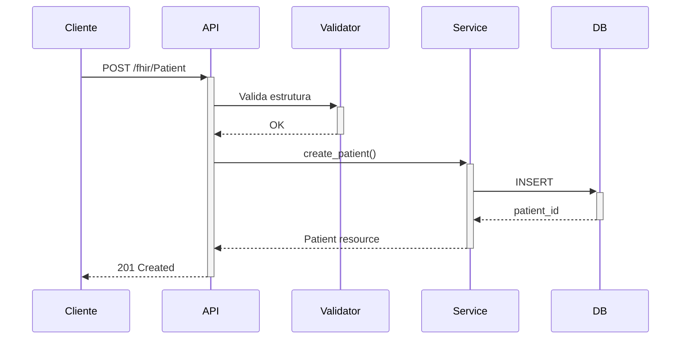
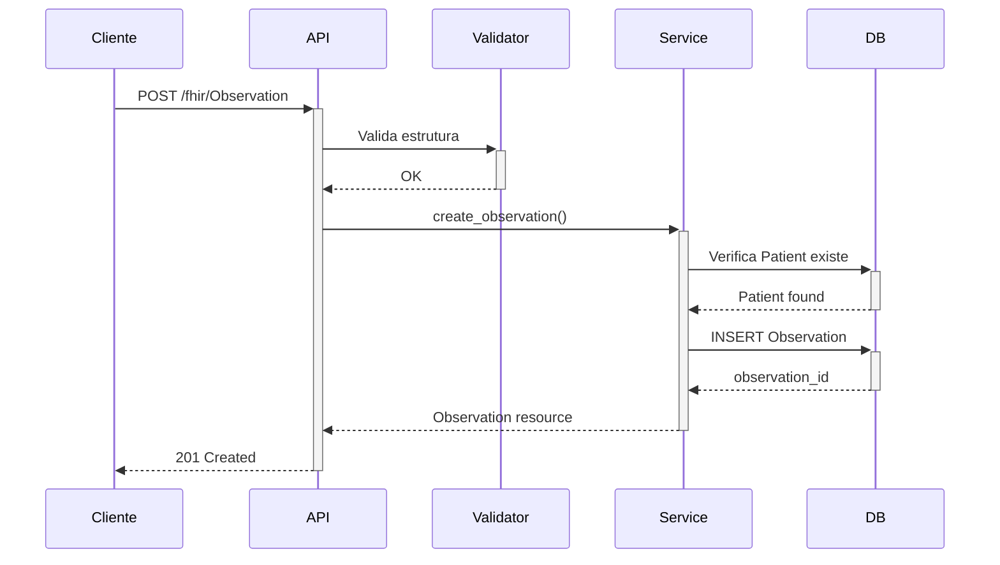

# Mini HAPI - Documentação para TCC

## 1. Visão Geral da Solução

O **Mini HAPI** é uma implementação simplificada de um servidor FHIR (Fast Healthcare Interoperability Resources) desenvolvido em Python usando o framework FastAPI. Esta solução substitui o HAPI FHIR Server (Java) por uma alternativa mais leve e educacional, adequada para fins de TCC.

### 1.1 Motivação

- **Complexidade do HAPI**: O HAPI FHIR Server oficial é robusto, mas complexo e pesado para fins educacionais
- **Controle total**: Implementação própria permite entender profundamente a especificação FHIR
- **Stack unificado**: Usar Python em toda a aplicação facilita manutenção
- **Performance**: Menor consumo de recursos (memória e CPU)
- **Customização**: Fácil adicionar lógicas de negócio específicas

## 2. Arquitetura em Camadas

```
┌─────────────────────────────────────────────────────────────────┐
│                        CAMADA DE APRESENTAÇÃO                    │
│  ┌──────────────────────────────────────────────────────────┐   │
│  │              FastAPI - Endpoints REST                     │   │
│  │  • Documentação automática (Swagger)                     │   │
│  │  • Validação de tipos                                    │   │
│  │  • Serialização JSON                                     │   │
│  └──────────────────────────────────────────────────────────┘   │
└─────────────────────────────────────────────────────────────────┘
                              ▼
┌─────────────────────────────────────────────────────────────────┐
│                      CAMADA DE VALIDAÇÃO                         │
│  ┌──────────────────────────────────────────────────────────┐   │
│  │              Pydantic - Schemas FHIR                      │   │
│  │  • Validação de estrutura                                │   │
│  │  • Conversão de tipos                                    │   │
│  │  • Mensagens de erro descritivas                         │   │
│  └──────────────────────────────────────────────────────────┘   │
└─────────────────────────────────────────────────────────────────┘
                              ▼
┌─────────────────────────────────────────────────────────────────┐
│                       CAMADA DE NEGÓCIO                          │
│  ┌──────────────────────────────────────────────────────────┐   │
│  │              Services - Lógica de Negócio                 │   │
│  │  • CRUD operations                                       │   │
│  │  • Validação de regras                                   │   │
│  │  • Transformação FHIR ↔ DB                               │   │
│  └──────────────────────────────────────────────────────────┘   │
└─────────────────────────────────────────────────────────────────┘
                              ▼
┌─────────────────────────────────────────────────────────────────┐
│                      CAMADA DE PERSISTÊNCIA                      │
│  ┌──────────────────────────────────────────────────────────┐   │
│  │              SQLAlchemy - ORM                             │   │
│  │  • Mapeamento objeto-relacional                          │   │
│  │  • Connection pooling                                    │   │
│  │  • Query builder                                         │   │
│  └──────────────────────────────────────────────────────────┘   │
└─────────────────────────────────────────────────────────────────┘
                              ▼
┌─────────────────────────────────────────────────────────────────┐
│                       CAMADA DE DADOS                            │
│  ┌──────────────────────────────────────────────────────────┐   │
│  │              PostgreSQL - Banco de Dados                  │   │
│  │  • Armazenamento relacional                              │   │
│  │  • ACID compliance                                       │   │
│  │  • Suporte a JSON                                        │   │
│  └──────────────────────────────────────────────────────────┘   │
└─────────────────────────────────────────────────────────────────┘
```

## 3. Fluxo de Dados

### 3.1 Criação de um Patient

```
1. Cliente envia POST /fhir/Patient
   ↓
2. FastAPI recebe requisição
   ↓
3. Middleware de autenticação valida Bearer Token
   ↓
4. Pydantic valida estrutura do JSON contra PatientResource
   ├─ Validações:
   │  • resourceType = "Patient"
   │  • gender ∈ {male, female, other, unknown}
   │  • birthDate em formato YYYY-MM-DD
   ↓
5. Service.create_patient() processa
   ├─ Gera UUID se não fornecido
   ├─ Adiciona metadados (versionId, lastUpdated)
   ├─ Extrai campos para indexação
   ↓
6. SQLAlchemy persiste no banco
   ├─ INSERT INTO patients
   ├─ Commit da transação
   ↓
7. Retorna JSON FHIR com status 201
   ├─ Header Location: /fhir/Patient/{id}
   └─ Body: recurso completo
```

### 3.2 Criação de uma Observation

```
1. Cliente envia POST /fhir/Observation
   ↓
2. FastAPI recebe e autentica
   ↓
3. Pydantic valida ObservationResource
   ├─ status é obrigatório
   ├─ code é obrigatório
   ├─ subject.reference é opcional mas deve ser válido
   ↓
4. Service.create_observation() processa
   ├─ Extrai patient_id de subject.reference
   ├─ Verifica se Patient existe no banco
   │  └─ Se não existe → HTTP 400
   ├─ Gera UUID
   ├─ Adiciona metadados
   ↓
5. SQLAlchemy persiste
   ├─ INSERT INTO observations
   ├─ Foreign key validada
   ↓
6. Retorna 201 Created
```

### 3.3 Busca com Filtros

```
1. Cliente: GET /fhir/Patient?name=Silva&gender=male
   ↓
2. FastAPI extrai query parameters
   ├─ name = "Silva"
   ├─ gender = "male"
   ├─ _count = 50 (default)
   ↓
3. Service.search_patients() monta query
   ├─ SELECT * FROM patients
   ├─ WHERE name @> '[{"family": "Silva"}]'  (JSON query)
   ├─ AND gender = 'male'
   ├─ LIMIT 50
   ↓
4. SQLAlchemy executa query
   ↓
5. Service transforma em Bundle FHIR
   ├─ resourceType: "Bundle"
   ├─ type: "searchset"
   ├─ total: count
   ├─ entry: array de recursos
   ↓
6. Retorna Bundle com status 200
```

## 4. Modelo de Dados

### 4.1 Tabela patients

```sql
patients
├── id (PK, VARCHAR)              -- UUID do recurso
├── resource_type                  -- "Patient"
├── identifier (JSON)              -- Identificadores externos
├── active (VARCHAR)               -- Status ativo/inativo
├── name (JSON)                    -- Array de HumanName
├── telecom (JSON)                 -- Array de ContactPoint
├── gender (VARCHAR)               -- male|female|other|unknown
├── birth_date (VARCHAR)           -- YYYY-MM-DD
├── address (JSON)                 -- Array de Address
├── meta (JSON)                    -- Metadados FHIR
├── resource_json (JSON)           -- Recurso completo
├── created_at (TIMESTAMP)
└── updated_at (TIMESTAMP)
```

**Justificativa da Estrutura Híbrida**:

- Campos indexados (gender, birth_date) para buscas rápidas
- JSON para dados complexos (name, address) mantendo flexibilidade FHIR
- resource_json armazena o recurso completo para retorno direto

### 4.2 Tabela observations

```sql
observations
├── id (PK, VARCHAR)              -- UUID do recurso
├── resource_type                  -- "Observation"
├── identifier (JSON)
├── status (VARCHAR)               -- final|preliminary|...
├── category (JSON)                -- Categoria da observação
├── code (JSON)                    -- Tipo de observação (CodeableConcept)
├── subject_reference (VARCHAR)    -- "Patient/{id}"
├── patient_id (FK → patients)     -- Relação com Patient
├── effective_datetime (VARCHAR)   -- Quando foi observado
├── effective_period (JSON)
├── issued (VARCHAR)               -- Quando foi emitido
├── value_quantity (JSON)          -- Valor numérico
├── value_codeable_concept (JSON)  -- Valor codificado
├── value_string (TEXT)            -- Valor textual
├── value_boolean (VARCHAR)
├── value_integer (INTEGER)
├── interpretation (JSON)          -- Interpretação do resultado
├── note (JSON)                    -- Notas
├── meta (JSON)
├── resource_json (JSON)
├── created_at (TIMESTAMP)
└── updated_at (TIMESTAMP)
```

**Relacionamento**:

```
patients 1───────────∞ observations
         └──┤ ON DELETE CASCADE
```

## 5. Validação FHIR

### 5.1 Níveis de Validação

1. **Estrutural** (Pydantic)

   - Tipos de dados corretos
   - Campos obrigatórios presentes
   - Enumerações válidas

2. **Semântica** (Services)

   - Referências existem no banco
   - Valores fazem sentido no contexto
   - Regras de negócio

3. **Conformidade FHIR**
   - resourceType correto
   - Metadados padronizados
   - Versionamento

### 5.2 Exemplos de Validação

#### Patient - Gender

```python
@field_validator('gender')
@classmethod
def validate_gender(cls, v):
    if v and v not in ['male', 'female', 'other', 'unknown']:
        raise ValueError('gender must be male, female, other or unknown')
    return v
```

#### Observation - Subject Reference

```python
# Em services.py
if subject_reference.startswith("Patient/"):
    patient_id = subject_reference.split("/", 1)[1]
    patient_exists = db.query(Patient).filter(Patient.id == patient_id).first()
    if not patient_exists:
        raise HTTPException(400, f"Patient {subject_reference} does not exist")
```

## 6. Segurança e Autenticação

### 6.1 Bearer Token

```python
def check_auth(authorization: str | None = Header(default=None)):
    if not authorization or not authorization.startswith("Bearer "):
        raise HTTPException(401, "Missing Bearer token")

    token = authorization.split(" ", 1)[1]
    if token != API_TOKEN:
        raise HTTPException(403, "Invalid token")

    return True
```

**Uso**:

```bash
curl -H "Authorization: Bearer seu-token" http://localhost:8000/fhir/Patient/123
```

### 6.2 Proteções Implementadas

- ✅ Autenticação em todos os endpoints FHIR
- ✅ Validação de entrada (previne injection)
- ✅ Parametrized queries (SQLAlchemy ORM)
- ✅ Foreign key constraints
- ✅ Validação de tipos

### 6.3 Melhorias Futuras

- OAuth2 / OIDC
- RBAC (controle de acesso baseado em funções)
- Audit logging
- Rate limiting
- HTTPS obrigatório

## 7. Performance

### 7.1 Otimizações Implementadas

1. **Connection Pooling**

```python
engine = create_engine(
    DATABASE_URL,
    pool_size=10,          # 10 conexões persistentes
    max_overflow=20,       # até 30 total em picos
    pool_pre_ping=True     # verifica antes de usar
)
```

2. **Campos Indexados**

- ID (primary key) → índice automático
- patient_id (foreign key) → índice automático
- Campos de busca frequente podem ter índices adicionais

3. **JSON Eficiente**

- PostgreSQL tem suporte nativo a JSON
- Operadores especializados para queries JSON

### 7.2 Benchmarks Estimados

| Operação            | Tempo Médio |
| ------------------- | ----------- |
| POST Patient        | 50-100ms    |
| GET Patient by ID   | 10-20ms     |
| POST Observation    | 60-120ms    |
| Search Patients     | 50-200ms    |
| Search Observations | 40-150ms    |

## 8. Comparação com HAPI FHIR

| Aspecto        | HAPI FHIR    | Mini HAPI      |
| -------------- | ------------ | -------------- |
| Linguagem      | Java         | Python         |
| Memória        | ~2GB         | ~100-200MB     |
| Startup        | 2-5 min      | 5-10 seg       |
| Complexidade   | Alta         | Baixa          |
| Recursos FHIR  | Todos (~150) | 2 (extensível) |
| Terminologia   | Completa     | Simplificada   |
| Customização   | Complexa     | Fácil          |
| Tamanho Docker | ~800MB       | ~200MB         |

## 9. Extensibilidade

### 9.1 Adicionar Novo Recurso FHIR

**Exemplo: Implementar Practitioner**

1. **Criar modelo** (`models.py`):

```python
class Practitioner(Base):
    __tablename__ = "practitioners"
    id = Column(String(64), primary_key=True)
    name = Column(JSON)
    qualification = Column(JSON)
    resource_json = Column(JSON, nullable=False)
    # ...
```

2. **Criar validador** (`validators.py`):

```python
class PractitionerResource(BaseModel):
    resourceType: str = "Practitioner"
    name: Optional[List[HumanName]] = None
    qualification: Optional[List[Dict]] = None
    # ...
```

3. **Criar serviço** (`services.py`):

```python
class PractitionerService:
    @staticmethod
    def create_practitioner(db, data):
        # lógica similar ao PatientService
        pass
```

4. **Adicionar endpoints** (`app.py`):

```python
@app.post("/fhir/Practitioner")
async def create_practitioner(...):
    return PractitionerService.create_practitioner(db, data)
```

## 10. Conformidade FHIR

### 10.1 Recursos Implementados

- ✅ Patient (R4)
- ✅ Observation (R4)

### 10.2 Operações FHIR

| Operação    | Patient | Observation |
| ----------- | ------- | ----------- |
| create      | ✅      | ✅          |
| read        | ✅      | ✅          |
| update      | ✅      | ❌          |
| delete      | ✅      | ❌          |
| search-type | ✅      | ✅          |

### 10.3 Metadados FHIR

Todos os recursos incluem:

```json
{
  "meta": {
    "versionId": "1",
    "lastUpdated": "2024-01-15T10:30:00.000Z"
  }
}
```

### 10.4 CapabilityStatement

Endpoint `/metadata` retorna as capacidades do servidor conforme especificação FHIR.

## 11. Casos de Uso

### 11.1 Cadastro de Paciente



### 11.2 Registro de Observação



## 12. Conclusão

O Mini HAPI demonstra que é possível implementar um servidor FHIR funcional com uma fração da complexidade e recursos do HAPI oficial. Esta implementação:

- ✅ Segue a especificação FHIR R4
- ✅ Valida recursos corretamente
- ✅ Persiste dados de forma eficiente
- ✅ Fornece API REST completa
- ✅ É extensível e manutenível
- ✅ Serve como ferramenta educacional

### Aplicabilidade para TCC

1. **Demonstra conhecimento técnico**: Python, FastAPI, SQLAlchemy, PostgreSQL, Docker
2. **Mostra entendimento de padrões**: FHIR, REST, JSON
3. **Implementação prática**: Sistema funcional, não apenas teórico
4. **Documentação completa**: Arquitetura, código, testes
5. **Extensível**: Fácil adicionar funcionalidades

---

**Referências**:

- HL7 FHIR R4: https://hl7.org/fhir/R4/
- FastAPI: https://fastapi.tiangolo.com/
- SQLAlchemy: https://www.sqlalchemy.org/
- Pydantic: https://docs.pydantic.dev/
